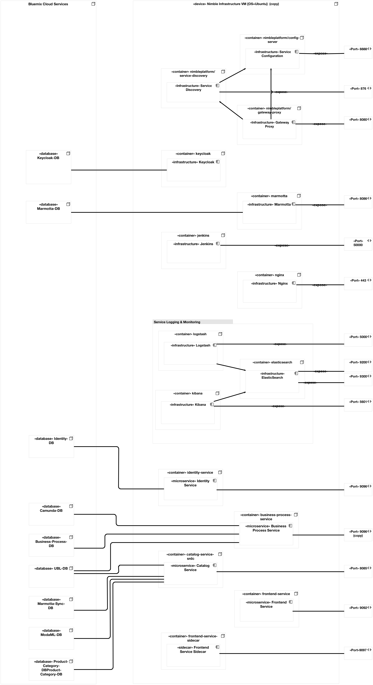

# Deployment Setup

The setup is split into to three configuration scenarios, whereas each scenario has 
a dedicated directory with the same name. The directory structure is as follows:

* `jenkins_ci`: setup for Jenkins CI
* `nginx`: setup and configuration for the webserver (i.e. nginx)
* `dev`: deployment setup for local development
* `staging`: 	deployment setup for staging environment
* `prod`: deployment setup used in production

Each deployment setup is composed of infrastructure componententes and 
the actual Microservices. A utility script with the name `run*.sh` can 
be found in the directories of each setup.

**Top Level Components**:

* **Nginx** is used a reverse proxy for each component.
	* **Configuration**: `nginx/docker-compose.yml`
	* **Nginx Configuration**: `nginx/nginx.conf`
	* **Manual Deployment**: `fab deploy logs -H <username>@<host>` (fabricate 
	
* **Jenkins** is used for continous integration.
	* **Configuration**: `jenkins_ci/docker-compose.yml`
	* **Docker File**: `jenkins_ci/Dockerfile`

## Productive Deployment

* Location: `prod`

In general the Platform is split into two different kind of components (1) infrastructure components (directory `infra`) and (2) microservice components (directory `services`).

### Infrastructure Components

These componentes are part of the virtual network with the name `nimbleinfraprod_default`. More information can be found bey executing `docker network inspect nimbleinfraprod_default` on the Docker host.

#### General Infrastructure

* Marmotta
	* **Configuration**: `prod/infra/docker-compose-marmotta.yml`
	* **Container Name**: nimbleinfraprod\_marmotta\_1 
* Keycloak
	* **Configuration**: `prod/keycloak/docker-compose-prod.yml`
	* **Container Name**: nimbleinfraprod\_keycloak\_1 
* ELK Stack
	* **Configuration**: `prod/elk-prod/docker-compose-elk.yml`
	* **Container Names**: nimbleinfraprod\_kibana\_1, nimbleinfraprod\_elasticsearch\_1, nimbleinfraprod\_logstash\_1

#### Microservice Infrastructure

Defintion can be found in `prod/services/docker-compose-prod.yml`, which consists of the following components:

* Config Server: 
	* **ServiceID**: config-server
	* **Container Name**: nimbleinfraprod\_config-server\_1

* Service Discovery: 
	* **ServiceID**: service-discovery
	* **Container Name**: nimbleinfraprod\_service-discovery\_1
	
* Gateway Proxy: 
	* **ServiceID**: gateway-proxy
	* **Container Name**: nimbleinfraprod\_gateway-proxy\_1

* Hystrix Dashboard (not used at the moment)
	* **ServiceID**: hystrix-dashboard

### Microservice Components:

Definition and configuration of the deployment can be found in `prod/services/docker-compose-prod.yml` and defines the follwing services:

* Identity Service
	* **ServiceID**: identity-service
	* **Container Name**: nimbleservicesprod\_identity-service\_1
* Business Process Service
	* **ServiceID**: business-process-service
	* **Container Name**: nimbleservicesprod\_business-process-service\_1
* Catalog Service
	* **ServiceID**: catalog-service-srdc
	* **Container Name**: nimbleservicesprod\_catalog-service-srdc\_1
* Frontend Service
	* **ServiceID**: frontend-service
	* **Container Name**: nimbleservicesprod\_frontend-service\_1
* Frontend Service Sidecar
	* **ServiceID**: frontend-service-sidecar
	* **Container Name**: nimbleservicesprod\_frontend-service-sidecar\_1

**Configuration** is done via environment variables, which are define in `prod/services/env_vars`. Secrets are stored in `prod/services/env_vars-prod` (this file is adapted on the hosting machine).

### Utility Script

A small utility script can be found in `run-prod.sh`, which provides the following functionalies:

* `run-prod.sh infra`: starts all infrastructure components 
* `run-prod.sh keycloak`: starts the Keycloak container
* `run-prod.sh marmotta`: starts the Marmotta container
* `run-prod.sh elk`: start all ELK components
* `run-prod.sh services`: starts all serivces (note: make sure the infastructue is set up appropriately)
* `run-prod.sh infra-logs`: print logs of all microservice components to stdout
* `run-prod.sh services-logs`: print logs of all services to stdout
* `run-prod.sh restart-single <serviceID>`: restart a single service

## Staging Deployment

* Location: `staging`

not yet active

## Development Deployment

* Location: `dev`

Recommended System Requirements (for Docker)
 * 16GB Memory
 * 4 CPUs

Minimum System Requirements (for Docker)
 * 10GB Memory / 2 CPUs

A small utility script can be found in `run-dev.sh`, which provides the following functionalies. More details for the startup are provided belows.

* `run-dev.sh infrastructure`: starts all microservice infrastructure components
* `run-dev.sh services`: starts all nimble core services (note: make sure the infastructue is set up appropriately)
* `run-dev.sh start`: starts infrastructure and services (not recommended at the first time)
* `run-dev.sh stop`: stop all services

The default port mappings from the `infra/docker-compose.yml` and `services/docker-compose.yml` files are used, but can be adapted depending on the local system requirements to avoid port binding errors.

It is recommended to start the infrastructure and the services in separate terminals for easier debugging.

### Starting microservice infrastructure

`./run-dev.sh infrastructure`: log output will be shown in the terminal

before continue to run services, check the infrastructure components:
  * `docker ps` should show 6 new containers up and running
	* `nimbleinfra_config-server_1` provides infrastructure configuration properties
	* http://localhost:8888/env => list configuration properties
	* `nimbleinfra_service-discovery_1` registeres all microservices
	* http://localhost:8761/eureka/apps => list registered apps (only "gateway-proxy" in the beginning)
	* `nimbleinfra_gateway-proxy_1` provides mappings to all the services
	* http://localhost/mappings => list of mappings provided by the proxy
	* `nimbleinfra_keycloak_1` manages identities and access control
	* http://localhost:8080 => Open Administration Console, login with `admin` and password `nimbleplatform`
	* https://localhost:8443 => same, but HTTPS
	* localhost:9999 => not used? if not, why exposed?
	* `nimbleinfra_keycloak-db_1` postgres db used by keycloak

### Starting the NIMBLE core services

`./run-dev.sh services`: log output will be shown in the terminal

  * `docker ps` should show 8 additional containers up and running
	* nimbleservices_identity-service_1
	* nimbleservices_identity-service-db_1
	* nimbleservices_business-process-service_1
	* nimbleservices_business-process-service-db_1
	* nimbleservices_camunda-db_1
	* nimbleservices_catalog-service-srdc_1
	* nimbleservices_frontend-service-sidecar_1
	* nimbleservices_frontend-service_1
	* http://localhost:9092/ => Access the NIMBLE Frontend directly
	* http://localhost/frontend => Access to the NIMBLE Frontend via Gateway Proxy

## Appendix

### Deployment Diagram

